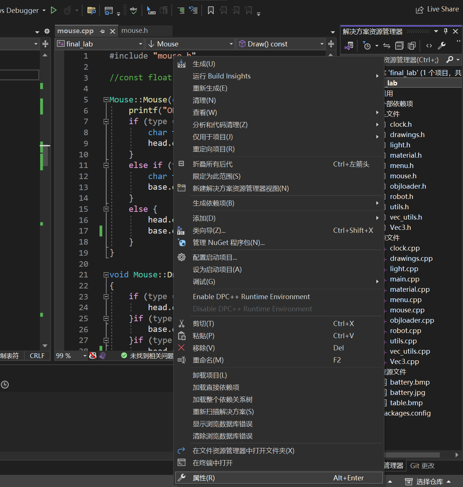
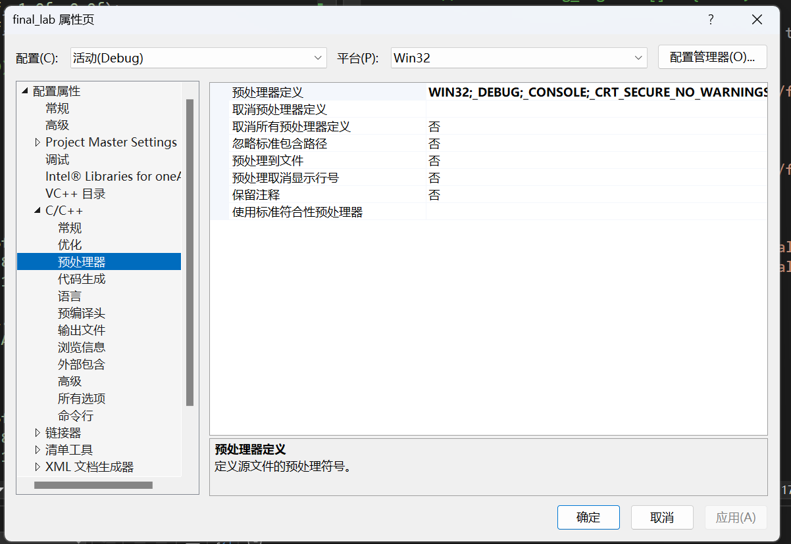
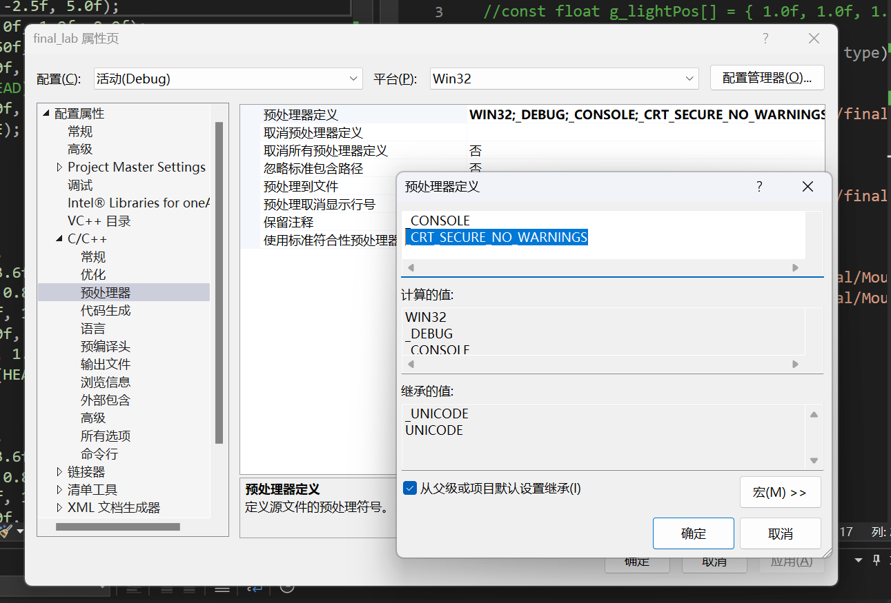
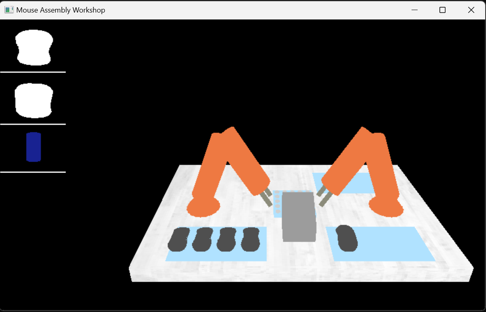
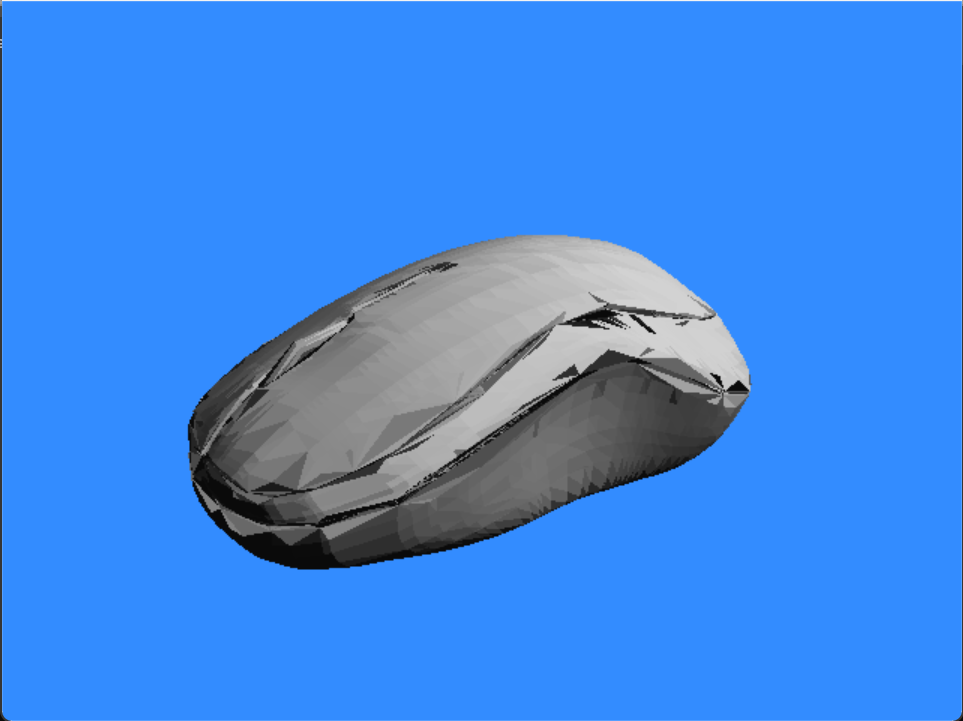

# MouseAssembly
CG project imitating mouse assembly workshop.

参考[ABB机器人IRB 120鼠标装配工作站-ABB13316608765_哔哩哔哩_bilibili](https://www.bilibili.com/video/BV1W64y1u7LL/?spm_id_from=333.1007.top_right_bar_window_history.content.click&vd_source=354c3e5aed42e0fa3fff228c9fee5f31)

## 说明！！！

+ 在OBJ导入部分用了一个线程不安全的函数，需要在预编译器重新设置流程如下：

  + 右击项目名称选择属性

  + 找C/C++下的预编译器选项

  + 在预处理器定义中加入_CRT_SECURE_NO_WARNINGS

    

+ 读取OBJ文件因为是相对路径，如果发现模型导入失败，可以检查文件路径是否正确

##文件结构说明

├─build

├─media

└─src

- build：可执行文件，但需要注意涉及到的各类图像资源的路径问题
- media：`README`用到的图像
- src：源代码+纹理图像+模型文件

## 建模部分

> 12.10 by曾楚芮

### 已实现功能

- 总体场景建构，包括桌子、机械臂、鼠标、鼠标外壳（右后）和鼠标底座（左前）以及相对的布局。
- 简单的编辑功能。左侧从上到下依次为鼠标底座、鼠标外壳和电池的编辑框，点击便可充满，但是未实现之后开始组装的逻辑（即减少的逻辑），可能需要添加物体的数量进行控制。

### 遗留问题以及解决思路

#### 鼠标精细程度

1. 鼠标外观模糊

2. 鼠标外壳和鼠标底座的分别问题

3. 缺少电池槽

   > 这一点很难办，看一下将就的效果。如果不行，再努力想办法

#### 解决思路

1. 实现存储功能。目前是读取`.ply`文件直接读取坐标，可能存在部分信息遗漏和不准确。

2. 实现光照。添加光照后，会有较大视觉上的差异。

   

3. 完善建模。以上两个部分实现后，根据需要完善建模，比如重新在`CAD`软件中进行建模和提取。

### 后续工作建议

1. 动画：实现装电池和外壳，以及实现编辑和编辑执行两个模式的切换。
2. 存储：实现读取`mouse.obj`，明确是否需要模型导出（存储）以及需要如何实现。
3. 光照：提高鼠标的视觉效果。
4. 如果有uu擅长`CAD`软件建模，可以帮忙；如果没有，我就“现学现卖”了。

### Obj导入

新加入了ObjLoader类，如果需要导入鼠标意外的OBJ模型可调用这个类，提供了导入OBJ和绘制该OBJ模型的方法

目前绘制鼠标需要调用类Mouse的成员函数，改变了以前直接调用静态函数的方式
