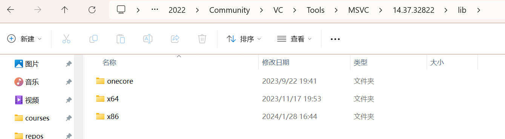

# MouseAssembly
CG project imitating mouse assembly workshop.

参考[ABB机器人IRB 120鼠标装配工作站-ABB13316608765_哔哩哔哩_bilibili](https://www.bilibili.com/video/BV1W64y1u7LL/?spm_id_from=333.1007.top_right_bar_window_history.content.click&vd_source=354c3e5aed42e0fa3fff228c9fee5f31)

## 说明！！！

+ 在OBJ导入部分用了一个线程不安全的函数，需要在预编译器重新设置流程如下：

  + 右击项目名称选择属性

  + 找C/C++下的预编译器选项

  + 在预处理器定义中加入_CRT_SECURE_NO_WARNINGS

    

+ 读取OBJ文件因为是相对路径，如果发现模型导入失败，可以检查文件路径是否正确

##文件结构说明

├─build

├─media

└─src

- build：可执行文件，但需要注意涉及到的各类图像资源的路径问题
- media：`README`用到的图像
- src：源代码+纹理图像+模型文件

## 建模部分

> 12.29

### nurbs绘制机械臂

### Obj导入

新加入了ObjLoader类，如果需要导入鼠标意外的OBJ模型可调用这个类，提供了导入OBJ和绘制该OBJ模型的方法

目前绘制鼠标需要调用类Mouse的成员函数，改变了以前直接调用静态函数的方式

最新效果：

鼠标外壳

鼠标底座

鼠标拼装效果

## 视角漫游

### 视角漫游库函数添加

默认使用visual studio，在项目属性中添加：

### 视角漫游方式说明

建立坐标轴指示旋转方向，按下`m`键可以显示或隐藏坐标轴。

关于视角漫游各个按键功能如下：

* 按下`w`键，相机向前移动；
* 按下`a`键，相机向左移动；
* 按下`d`键，相机向右移动；
* 按下`s`键，相机向后移动；
* 按下`q`键，相机向上移动；
* 按下`e`键，相机向下移动；

当鼠标左键按下时，可以通过移动鼠标进行视角旋转。

### GUI

配置相关。

C/C++预处理器添加 GLUIDLL

在链接器的附加依赖项中添加glui32ddl.lib

在原先放glut和glew头文件的位置放glui.h，如图。

在lib中放入lib文件(选择x86或者x64)

在SysWOW64或者System32中放ddl文件。

## 编辑与执行切换

右键->Run

组装完一个或者遇到意外回到编辑模式
